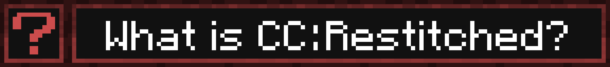
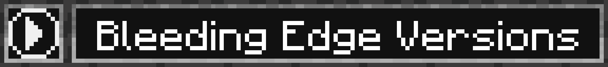
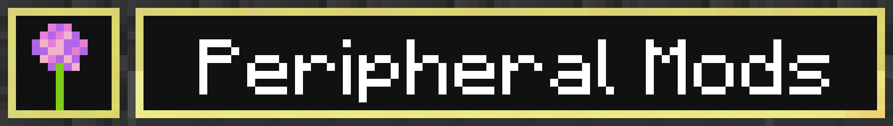

This is a port of [cc-tweaked/CC-Tweaked](https://github.com/cc-tweaked/CC-Tweaked) to the [Fabric modloader](https://fabricmc.net/) as well as being a continuation of [JemmaZZ/cc-tweaked-fabric](https://github.com/JemmaZZ/cc-tweaked-fabric) and can be found at [Github Actions](https://github.com/cc-tweaked/cc-restitched/actions), [Modrinth](https://modrinth.com/mod/cc-restitched) and [Curseforge](https://www.curseforge.com/minecraft/mc-mods/cc-restitched).

CC: R tries to maintain parity with CC: T, though it may be behind or divergent in some areas. If you notice a disparity please open an issue. CC: R major and minor version numbers indicate parity with the major features of that version of CC: T. Patch version numbers will NOT align.

This mod includes textures by [Jummit](https://github.com/Jummit) that are more in line with the style of Mojang's new texture-artist, Jappa. If you prefer the original ComputerCraft textures you should  enable the `classic` resource pack.
 We also have a third resourcepack made by [3prm3](https://github.com/3prm3), it features a complete overhaul of CC's textures (in the style of an industrial mod) and can be used by enabling the `overhaul` resource pack. You can also check out his resource pack over [here](https://github.com/cc-orgs/cc-overhaul/tree/main) as  well!

Bleeding edge builds can be found [here](https://github.com/cc-tweaked/cc-restitched/actions) at Github Actions.
In the .zip file there should be a `-dev` jar, a `-javadoc` jar, a `-sources-dev` jar, a `-sources` jar, and a "plain" jar (jar without an affixed tag) jar.
Put the "plain" jar in the mods folder.

Any contribution is welcome, be it using the mod, reporting bugs or contributing code. In order to start helping develop CC: R there are a few rules;
1) Follow the [Fabric](https://fabricmc.net/) programming guidelines as close as possible. This means you have to use [`loom`](https://fabricmc.net/wiki/tutorial:mappings) mappings, if you use anything else, your code will be rejected.
2) Make sure your code follows the checkstyle rules. You can test this by running `./gradle build` or `./gradle check`.
3) You cannot intentionally implement bugs and security vulnerabilities.
4) Unless the code is taken directly from CC: Tweaked, `lua` code is offlimits from alteration. If you wish to contribute your changes to the in game rom please contribute upstream at [CC-Tweaked](https://github.com/cc-tweaked/CC-Tweaked).
5) Branches should be named in this format `mc-<major ver.>.x/<specific-mc-ver.>`

* [ YES ] [Sodium](https://www.curseforge.com/minecraft/mc-mods/sodium)
* [ YES ] [OptiFabric](https://www.curseforge.com/minecraft/mc-mods/optifabric)
	* Works with VBO Rendering (automatically set)
	* No issues
* [ YES ] [Iris Shaders & Sodium](https://www.curseforge.com/minecraft/mc-mods/irisshaders)
* [ YES ] [Canvas](https://www.curseforge.com/minecraft/mc-mods/canvas-renderer)
	* Works with TBO Rendering (Default)
- 
	* Scuffed with VBO Rendering
	* 

		
VBO is broken

  		Monitors are following the player?.
		- 
        - 
		- 
			* The screen seems to get bigger the closer you get to it.
		

If you need help getting started with CC: Restitched, want to show off your latest project, or just want to chat about ComputerCraft, here is the [Computercraft Forum](https://forums.computercraft.cc/) and the Computer Mods [Discord!](https://discord.gg/H2UyJXe). There is also a wiki that can be found at [https://tweaked.cc/](https://tweaked.cc/)

Unfortunately, CC: Restitched does not have as many peripherals mods available as CC: Tweaked though there is one known as Allium Peripherals made by [hugeblank](https://github.com/hugeblank) which can be found [here](https://www.curseforge.com/minecraft/mc-mods/allium-peripherals). But if you're an interested mod developer, please check out our `api` package. If you've already made a mod with CC: R peripheral support OR if you're a player who found a mod with CC: R integration, please open an issue [here](https://github.com/cc-tweaked/cc-restitched/issues/new?assignees=&labels=peripheralShoutout&template=peripheral_shoutout.md) to let us know and we'll add it to the list!
